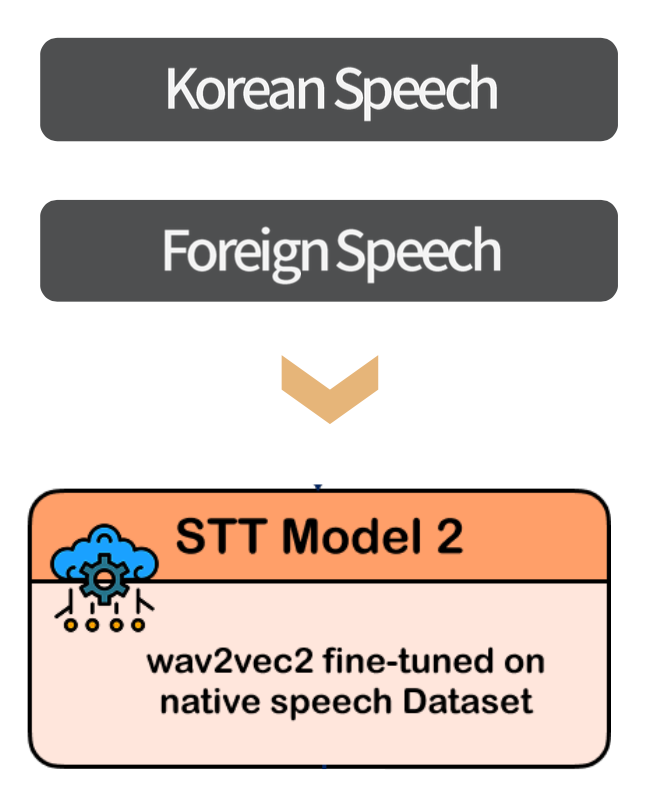

# STT_Korean

STT model for transcribing speech based on how native Korean listeners perceive it.

The goal was to develop a model capable of acting as a “Korean listener,” meaning it can transcribe speech as it sounds from the perspective of a native Korean speaker.



Accordingly, the model selected during initial experiments was Wav2Vec2, as it showed potential in transcribing what is heard as-is.

Considering the role of a Korean listener, the learning rate was set relatively low at 1e-4 to allow the model to converge slowly and become more familiar with Korean speech.

While testing the results, we adjusted the dataset size, learning rate, and batch size (to avoid OOM) in an attempt to find a set of hyperparameters where the model transcribes Korean speakers accurately and foreign speakers phonetically, based on what it hears.

Version v7 was selected as the fine-tuned model best suited for this role, and the final demo used the v7 model.

### Gitbub directory

```
model_selec : Model comparison experiments for use in STT_Korean
  ├─ wav2vec2 : wav2vec2 fine-tuning (dataset 100)
  └─ whisper : whisper fine-tuning (dataset 100)

model_tuning/
  ├─ 1. script_preprocessing.py : Label data preprocessing (symbol removal, select A in A/B structure)
  ├─ 2. train_koko_wav2vec2.py : Audio preprocessing, model loading, fine-tuning
  ├─ 3. model_test_ko.py : Test fine-tuned model using Korean native speech (case 1)
  └─ 4. model_test_fo.py : Test fine-tuned model using foreigner Korean speech (case 2)

model_tuning_2/
  ├─ 1. model_test_ko.py : Test fine-tuned model using Korean native speech (case 1)
  ├─ 2. model_test_fo.py : Test fine-tuned model using foreigner Korean speech (case 2)
  ├─ 3. model2_experiment_2 : Fine-tuning code, result = v3
  ├─ 4. README.md : Hyperparameter description and experiment plan
  ├─ 5. script_preprocessing_hotfix.py : Bug fix for label preprocessing
  └─ 6. script_preprocessing.py : Original label preprocessing code (with bugs)

model_tuning_3/
  ├─ 1. model2_experiment_2 : Fine-tuning code, result = v5
  ├─ 2. README.md : Hyperparameter description and experiment plan
  ├─ 3. result.txt : Sample outputs (case 1, 2)
  └─ 4. training_log.csv : Training log

model_tuning_4/
  ├─ 1. README.md : Hyperparameter description and experiment plan
  ├─ 2. result.txt : Sample outputs (case 1, 2)
  ├─ 3. training_log.csv : Training log
  ├─ 4. v6_modify.py : Fine-tuning code, result = v6
  └─ 5. v6.py : Fine-tuning code (OOM occurred)

model_tuning_5/
  ├─ 1. convert_pkl.py : Code to convert to .pkl format
  ├─ 2. convert_pth.py : Code to convert to .pth format
  ├─ 3. README.md : Hyperparameter description and experiment plan
  ├─ 4. result.txt : Sample outputs (case 1, 2)
  └─ 5. v7.py : Fine-tuning code, result = v7

v7_performance.txt : WER and CER results using validation data


model_tuning_6/
  ├─ 1. README.md : Hyperparameter description and experiment plan
  ├─ 2. result.txt : Sample outputs (case 1, 2)
  └─ 3. v8.py : Fine-tuning code, result = v8

model_tuning_7/
  ├─ 1. README.md : Hyperparameter description and experiment plan
  ├─ 2. result.txt : Sample outputs (case 1, 2)
  └─ 3. v10.py : Fine-tuning code, result = v10

```

### Server directory

tuning infra : school's SW중심 사업단 AI 서버 (3090 \* 4)

```
Data used for training (not directory structure): AI Hub [Korean Conversation Speech - “Daily Life” section]
  ├─ train/: Training data (80%)
  ├─ validation/: Validation data (10%)
  └─ test/: Test data (10%)

model_tuning/: Fine-tuning performed using the experimental scripts described above

wav2vec2_korean_v@/: Stores trained model weights, configuration files, logs, etc.
  ├─ added_tokens.json
  ├─ preprocessor_config.json
  ├─ vocab.json
  ├─ config.json
  ├─ special_tokens_map.json
  ├─ model.safetensors
  └─ tokenizer_config.json

README.md
  ├─ Project description, instructions for execution, etc.

```
