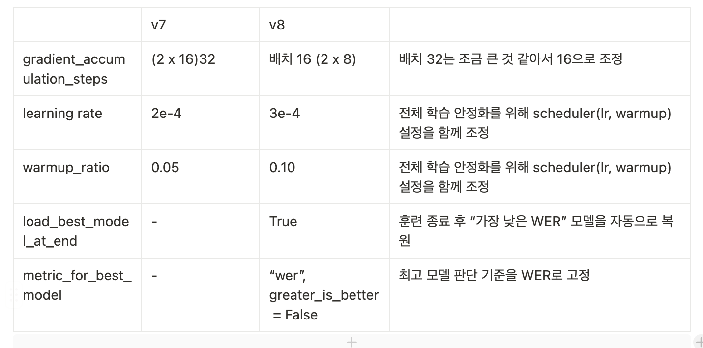

dataset : 38000개 ( 30400/ 3800/ 3800)

### 🛠️ TrainingArguments 설정표



### code

```python
training_args = TrainingArguments(
    output_dir="./wav2vec2_finetune_ko_v8",
    eval_steps=500,
    save_steps=500,
    logging_steps=50,
    evaluation_strategy="steps",
    save_total_limit=3,
    num_train_epochs=25,
    per_device_train_batch_size=2,
    per_device_eval_batch_size=2,
    gradient_accumulation_steps=8,   
    fp16=True,
    group_by_length=True,
    weight_decay=0.005,
    learning_rate=3e-4,                 # ★ v8 변경
    warmup_ratio=0.10,                  # ★ v8 변경
    dataloader_num_workers=4,
    report_to="none",
    load_best_model_at_end=True,        # ★ v8 추가
    metric_for_best_model="wer",        # ★ v8 추가
    greater_is_better=False             # ★ v8 추가
)
```